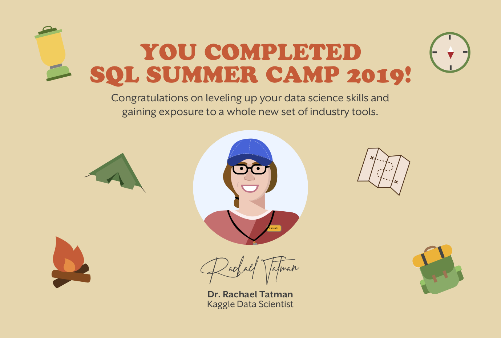

# Kaggle: SQL Summer Camp 2019
###### with Rachael Tatman

* [[Intro to SQL](https://www.kaggle.com/learn/intro-to-sql)] course, 'with some additional stuff from [Rachael]' ...(25-27/6/19, 16-18/7/19)
* [EXTRA]: [BigQuery ML Workshop](https://www.kaggle.com/rtatman/bigquery-machine-learning-tutorial) ...(7/8/19)
* [[Advanced SQL](https://www.kaggle.com/learn/advanced-sql)] course ...(27-30/8/19)

## [Intro] Day1: Getting Started with SQL & BigQuery
###### (2019-06-25)

"Today we’re going to learn what relational databases [are], when you should use them and how to interact with SQL datasets on Kaggle. Let’s jump right in"

* [Notebook](https://www.kaggle.com/dansbecker/getting-started-with-sql-and-bigquery) with lesson
* [Notebook](https://www.kaggle.com/mbeveridge/exercise-getting-started-with-sql-and-bigquery) with exercises. **DONE**. (To save your work, sign in to your Kaggle account! ...*else work will disappear after 15min*)
* [Livestream (recording 25/6/19)](https://www.youtube.com/watch?v=jYQoQfFzJRw) (~30min + 30min Q&A) [*[@9'00](https://youtu.be/jYQoQfFzJRw?t=540) "BigQuery [from Google] is just where the data[set] that we want to query is [hosted] ... The SQL syntax is going to be the same, more or less ... no matter what service you use"*] [*[@9'48](https://youtu.be/jYQoQfFzJRw?t=588) "One really nice thing is that you don't actually have to setup any authentication, to use BigQuery data on Kaggle"*] [*[@31'40](https://youtu.be/jYQoQfFzJRw?t=1900) how to use R instead of Python*] [*[@38'50](https://youtu.be/jYQoQfFzJRw?t=2330)-39'40 What problem does BigQuery solve? Run queries v quickly, even if dataset is v large*] [*[@46'45](https://youtu.be/jYQoQfFzJRw?t=2805)-48'30 Link to all the [BigQuery client commands](https://googleapis.github.io/google-cloud-python/latest/bigquery/reference.html)*] [*[@48'40](https://youtu.be/jYQoQfFzJRw?t=2920)-49'00 Can we use BigQuery with R?*] [*[@57'10](https://youtu.be/jYQoQfFzJRw?t=3430)-57'55 What can you not do with pandas that you can do with SQL (after you've imported a dataset to a dataframe)? Not much. With SQL, you don't have to have your data locally (re. size). And SQL tends to be a bit quicker, for same size of data*]

*To use BigQuery, we'll import the Python package `bigquery`. Then create a `Client` object. Create a reference to our `hacker_news` dataset (which is in `bigquery-public-data` project) and then we can fetch the dataset. Similarly, create a reference to an individual table (which is in the dataset) and then we can fetch the table*

*Rachel's ['BigQuery Scratchpad'](https://www.kaggle.com/rebeccaturner/bigquery-scratchpad) kernel, created during Livestream*

*['Kaggle > Discussion > Learn'](https://www.kaggle.com/learn-forum) for the forum, to ask questions. Including "[Slides from the first SQL livestream](https://www.kaggle.com/learn-forum/97118)"*

## [Intro] Day2: Select, From & Where
###### (2019-06-26)

"Now that you know what relational databases are and how to access BigQuery data on Kaggle we’re ready to start writing SQL code. Today we’ll cover the basic building blocks of SQL queries: select, from and where"

* [Notebook](https://www.kaggle.com/dansbecker/select-from-where) with lesson
* [Notebook](https://www.kaggle.com/mbeveridge/exercise-select-from-where) with exercises. **DONE**
* [Livestream (recording 26/6/19)](https://www.youtube.com/watch?v=VljQui5es7g) (~30min + 30min Q&A) [*[@15'50](https://youtu.be/VljQui5es7g?t=950) "Now let's write a query"*] [*[@21'45](https://youtu.be/VljQui5es7g?t=1305) "...more queries"*] [*[@29'39](https://youtu.be/VljQui5es7g?t=1779) "I only want to run jobs if they are less than 100MB"*] [*[@30'42](https://youtu.be/VljQui5es7g?t=1842) "No, it still worked [didn't give an error msg]. Oh, it's cos it's cached [which doesn't count against your quota]. Oh, I need to write a new query"*] [*[@33'05](https://youtu.be/VljQui5es7g?t=1985) "Let's answer some questions"*] [*[@35'50](https://youtu.be/VljQui5es7g?t=2150) "Filter based on '#bigquery' and you can see all of our BigQuery datasets"*] [*[@46'45](https://youtu.be/VljQui5es7g?t=2805) "The SQL itself is not case-sensitive, but the strings you pass to be evaluated are case-sentive"*] [*[@56'56](https://youtu.be/VljQui5es7g?t=3416) "Let's quickly write a little regular expression, cos I'm interested in this"*]

*['openaq' dataset](https://www.kaggle.com/open-aq/openaq) ...re. [@9'56](https://youtu.be/VljQui5es7g?t=596) Livestream*

*Rachel's ['Select, From, Where scratchpad'](https://www.kaggle.com/rebeccaturner/select-from-where-scratchpad) kernel, created during Livestream*

*['Kaggle > Discussion > Learn'](https://www.kaggle.com/learn-forum) for the forum, to ask questions*

## [Intro] Day3: Group By, Having & Count
###### (2019-06-27)

"Today we’re going to learn how to write SQL queries that will help summarize the data in the database and let you ask more complicated questions"

* [Notebook](https://www.kaggle.com/dansbecker/group-by-having-count) with lesson
* [Notebook](https://www.kaggle.com/mbeveridge/exercise-group-by-having-count) with exercises. **DONE**
* [Livestream (recording 27/6/19)](https://www.youtube.com/watch?v=dV74IWUkI8Q) (~30min + 30min Q&A) [*[@4'11](https://youtu.be/dV74IWUkI8Q?t=251) "I can see that I have this kernel running. And you can only have 4 kernels running"*] [*[@6'06](https://youtu.be/dV74IWUkI8Q?t=366) "Today we're going to learn how to aggregate, and how to start asking questions using SQL code" (instead of Python, R)*] [*[@13'05](https://youtu.be/dV74IWUkI8Q?t=785) "'Having' lets you ... filter things once they've been grouped. It's very similar to Where, but Having works with Group By"*] [*[@28'20](https://youtu.be/dV74IWUkI8Q?t=1700) "Let's look at questions"*] [*[@30'42](https://youtu.be/dV74IWUkI8Q?t=1842) "Why is `bq_helper` sometimes referred to?" It's a library that Rachael created, but is no longer used [v's `client`], but some kernels still talk about it*] [*[@36'50](https://youtu.be/dV74IWUkI8Q?t=2210) `COUNT(*)` v's `COUNT(1)` v's `COUNT(id)`*]

*Rachel's ['Group by, having & count scratchpad'](https://www.kaggle.com/rebeccaturner/group-by-having-count-scratchpad) kernel, created during Livestream*

*['Kaggle > Discussion > Learn'](https://www.kaggle.com/learn-forum) for the forum, to ask questions*

## [Intro] Day4: Order By, Extract & Dates
###### (2019-07-16)

"Today we’re going to talk about how to sort the data you get back from your query and, even more importantly, how to deal with dates"

* [Notebook](https://www.kaggle.com/dansbecker/order-by) with lesson
* [Notebook](https://www.kaggle.com/mbeveridge/exercise-order-by) with exercises. **DONE**
* [Livestream (recording 16/7/19)](https://www.youtube.com/watch?v=jEdgQ-RVmXw) (~30min + 30min Q&A) [*[@4'00](https://youtu.be/jEdgQ-RVmXw?t=240) "That's not so good. So I should be able to see a copy of the data in the database"*] [*[@6'21](https://youtu.be/jEdgQ-RVmXw?t=381) "So, how do you sort?"*] [*[@9'20](https://youtu.be/jEdgQ-RVmXw?t=560) "The next thing is dates"*] [*[@14'55](https://youtu.be/jEdgQ-RVmXw?t=895) "The way that we get information from dates is using `EXTRACT`"*] [*[@19'55](https://youtu.be/jEdgQ-RVmXw?t=1195) "I need to add this dataset to my kernel"*] [*[@24'10](https://youtu.be/jEdgQ-RVmXw?t=1450) "This is in triple quotation marks because it's actually a string. And BigQuery does expect us to send it a string"*] [*[@25'00](https://youtu.be/jEdgQ-RVmXw?t=1500) "We are going to do a 'safe config'" (re. 1GB of billing quota)*] [*[@26'51](https://youtu.be/jEdgQ-RVmXw?t=1611) "Those are all of the things we are going to talk about today"*] [*[@32'15](https://youtu.be/jEdgQ-RVmXw?t=1935) "And now, within our data, it's sorted first by Quarter ... and then ... by 'number of accidents'. So yes, you can sort by multiple columns"*] [*[@36'16](https://youtu.be/jEdgQ-RVmXw) "So I think it's only going to be from dates" (that `EXTRACT` will work)*] [*[@37'46](https://youtu.be/jEdgQ-RVmXw?t=2266) (re. order you call columns in the query) "`GROUP BY` shouldn't matter, `ORDER BY` should" (...Commutative property, can multiply things in any order)*] [*[@38'31](https://youtu.be/jEdgQ-RVmXw?t=2311) "What is the benefit of using `EXTRACT`, instead of directly `DAY(date)`?" - doesn't work*] [*[@43'55](https://youtu.be/jEdgQ-RVmXw?t=2635) "You don't need to `SELECT` a column, to `GROUP BY` it, **but**..."*] [*[56'16](https://youtu.be/jEdgQ-RVmXw?t=3376) "I think that the problem is that we have a timestamp and not a date"*]

*['Kaggle > Discussion > Learn'](https://www.kaggle.com/learn-forum) for the forum, to ask questions*

## [Intro] Day5: As & With
###### (2019-07-17)

"At this point we know quite a few SQL commands. As you write bigger and more complex queries, it becomes more important to break them into small, understandable chunks. Today we’ll learn how to do this using WITH and AS"

* [Notebook](https://www.kaggle.com/dansbecker/as-with) with lesson
* [Notebook](https://www.kaggle.com/mbeveridge/exercise-as-with) with exercises. **DONE**
* [Livestream (recording 17/7/19)](https://www.youtube.com/watch?v=Hk3OK2G5U5I) (~30min + 30min Q&A) [*[@5'40](https://youtu.be/Hk3OK2G5U5I?t=340) "So that's how `AS` works"*] [*[@6'10](https://youtu.be/Hk3OK2G5U5I?t=370) "But we can also use `WITH` [and `AS`] to refer to a 'CTE' (common table expression) that we have `SELECT` & created" (...but only within scope of that query) (...modular)*] [*[@10'26](https://youtu.be/Hk3OK2G5U5I?t=626) "I see people tend to use single letters for aliasing in this way" ...but I suggest not*] [*[@14'12](https://youtu.be/Hk3OK2G5U5I?t=852) "This query's doing a couple of things, so let's walk through it"*] [*[@21'00](https://youtu.be/Hk3OK2G5U5I?t=1260) "One of the things that I hear a lot, from software engineers, when they're talking about code that they get from data scientists... [be more modular and import from a script]"*] [*[@24'01](https://youtu.be/Hk3OK2G5U5I?t=1441) "Let's ... get questions"*] [*[@30'19](https://youtu.be/Hk3OK2G5U5I?t=1819) "The syntax for multiple `WITH` clauses is..."*] [*[@45'58](https://youtu.be/Hk3OK2G5U5I?t=2758) "The reason why ... this query has problems ... is because here we are not aggregating over everything we select. So let me back up and say what I mean..."*] [*[@55'12-62'00](https://youtu.be/Hk3OK2G5U5I?t=3312) "What if we GROUP by two fields which we know would not return us the same number of groups (eg. days and months)?..."*]

*Rachel's ['With and As Scratchpad'](https://www.kaggle.com/rebeccaturner/with-and-as-scratchpad) kernel, created during Livestream*

*['Kaggle > Discussion > Learn'](https://www.kaggle.com/learn-forum) for the forum, to ask questions*

## [Intro] Day6: Joining Data
###### (2019-07-18)

"We’ve learned a lot about how to get data out of one table in our database… but what about when we want to combine information from more than one table? That’s where joins come in, and that’s what we’ll be going over today"

* [Notebook](https://www.kaggle.com/dansbecker/joining-data) with lesson
* [Notebook](https://www.kaggle.com/mbeveridge/exercise-joining-data) with exercises. **DONE**
* [Livestream (recording 18/7/19)](https://www.youtube.com/watch?v=_ERmqiYnrNs) (~30min + 30min Q&A) [*[@3'01](https://youtu.be/_ERmqiYnrNs?t=181) "I was going to show you that in GoogleSheets, you can actually write SQL queries ... (but I think it's going to take too long)"*] [*[3'20-4'10](https://youtu.be/_ERmqiYnrNs) 'super duper fast review'*] [*[@9'37](https://youtu.be/_ERmqiYnrNs?t=577) "So, we want to join these two tables together"*] [*[@19'57](https://youtu.be/_ERmqiYnrNs?t=1197) "And we want to look at the number of files per license..." so will need to `JOIN`*] [*[@24'50](https://youtu.be/_ERmqiYnrNs?t=1490) "And I'm going to just print out the `head` of that dataframe"*] [*[@28'32](https://youtu.be/_ERmqiYnrNs?t=1712) "It is time for questions"*] [*[@38'04](https://youtu.be/_ERmqiYnrNs?t=2284) "This is the order in which they're executed" (not order in which written)*] [*[@39'22](https://youtu.be/_ERmqiYnrNs?t=2362) "So `JOIN` comes 3rd in the execution order"*] [*[55'15](https://youtu.be/_ERmqiYnrNs?t=3315) "Again, I have never heard of 'Junction Tables' before, so that's something for me to research"*] [*[58'11](https://youtu.be/_ERmqiYnrNs?t=3491) "...I don't know the answer. There's a lot of reasons that it could be, and I just don't know"*]

*Rachel's ['Join Scratchpad'](https://www.kaggle.com/rebeccaturner/join-scratchpad) kernel, created during Livestream* - **REMOVED**

*['Kaggle > Discussion > Learn'](https://www.kaggle.com/learn-forum) for the forum, to ask questions*

## [EXTRA]: BigQuery ML Workshop
###### (2019-08-07)

"Today we’re going to be training and deploying ML models using BigQuery Machine Learning"

"Make sure you’ve set up your GCP account. You can follow [this blog post](http://blog.kaggle.com/2019/06/24/kaggle-kernels-notebooks-now-offers-bigquery/) or [this video](https://www.youtube.com/watch?v=_YYqfS7rLUo)"

* [Notebook](https://www.kaggle.com/rtatman/bigquery-machine-learning-tutorial) with tutorial
* [Notebook](https://www.kaggle.com/mbeveridge/bigquery-machine-learning-exercise) with exercises. **DONE**
* [Livestream (recording 7/8/19)](https://www.youtube.com/watch?v=a1onYwwFqj0) (~30min + 30min Q&A) [*[@1'53](https://youtu.be/a1onYwwFqj0?t=113) "Let's call this project 'rachael bqml tutorial'"*] [*[@2'31](https://youtu.be/a1onYwwFqj0?t=151) "And the one I just made isn't showing up, because I haven't got any datasets or models in it yet"*] [*[@2'59](https://youtu.be/a1onYwwFqj0?t=179) "We're ready to start going"*] [*[@3'41](https://youtu.be/a1onYwwFqj0?t=221) "What is BigQuery ML? When should you use it?"*] [*[@7'24](https://youtu.be/a1onYwwFqj0?t=444) "You can upload pre-trained TensorFlow models and then they'll be served from within BigQuery"*] [*[@9'05](https://youtu.be/a1onYwwFqj0?t=546) "The first thing I need to do is link my instance - my project - to my notebook"*] [*[@9'44](https://youtu.be/a1onYwwFqj0?t=584) "We're doing something a little bit different here than we've done previously" (using the notebook magic)*] [*[@10'20](https://youtu.be/a1onYwwFqj0?t=620) "And then you can type SQL directly, without having to put it in the triple quotes, without having to send it to a query object ... This will only work in Jupyter"*] [*[10'54](https://youtu.be/a1onYwwFqj0?t=654) "Today, we are going to be working, for the tutorial, with Google Analytics sample dataset"*] [*[@12'23](https://youtu.be/a1onYwwFqj0?t=743) "And it looks a little bit different ... It's a little bit more complex in terms of data structure"*] [*[@13'36](https://youtu.be/a1onYwwFqj0?t=816) "They are what are called 'structs', or records. So it's basically* **like a JSON file inside a cell**"] [*[@15'08](https://youtu.be/a1onYwwFqj0?t=908) "We'll get the `column name`[`dot`] `the field name we're interested in`"*] [*[@16'06](https://youtu.be/a1onYwwFqj0?t=969) "So,* **we know what the dataset looks like. Now to train a model**"] [*[@16'40](https://youtu.be/a1onYwwFqj0?t=1000) "While it trains, we'll talk about what's in this query. Because this is a big query"*] [*[@19'51](https://youtu.be/a1onYwwFqj0?t=1191) "For logistic regression specifically, if it tries to predict a Null you'll get an error, so we are converting the Nulls to 0"*] [*[@23'02](https://youtu.be/a1onYwwFqj0?t=1382) "This is a complex query ... This is a model that has a fairly large number of things going on in it ... We wanted to show you the range of [options]"*] [*[@23'57](https://youtu.be/a1onYwwFqj0?t=1437) "We've trained our model. Now,* **if you're interested, you can get information on the training statistics**"] [*[@25'24](https://youtu.be/a1onYwwFqj0?t=1524) "So, we didn't have to do a lot, but how did the model do? ... We are going to use this `ML.EVALUATE(MODEL)` function"*] [*[@28'16](https://youtu.be/a1onYwwFqj0?t=1696) "So, this looks pretty good. I'm pretty happy with this"*] [*[@28'44](https://youtu.be/a1onYwwFqj0?t=1724)* "**Can we use it to predict?** *Yes ... It's already in our database, we can just ask for predictions"*] [*[@32'15](https://youtu.be/a1onYwwFqj0?t=1935) "I am going to take questions now"*] [*[@34'58](https://youtu.be/a1onYwwFqj0?t=2098) "How can I send a request to this model from - let's say - a website?"*] [*[37'28](https://youtu.be/a1onYwwFqj0?t=2248) "The reason why you need to link a BigQuery account to do this is because the Kaggle BigQuery account does not have write permissions"*] [*[58'37](https://youtu.be/a1onYwwFqj0?t=3517) "How to run prediction on fresh data?"*]

## [Advanced] Day1: JOINs & UNIONs
###### (2019-08-27)

"Waaaay back during the very first day of camp, we talked about how relational databases are made of multiple tables and, during the second week of camp, we briefly talked about joins. Today we’re going to dig a little deeper into different ways to combine data from across different tables"

* [Notebook](https://www.kaggle.com/alexisbcook/joins-and-unions) with lesson
* [Notebook](https://www.kaggle.com/mbeveridge/exercise-joins-and-unions) with exercises. **DONE**
* [Livestream](https://www.youtube.com/watch?v=tC0I2m3FP0Y) (recording 27/8/19) (~30min + 30min Q&A) [*[@1'41](https://youtu.be/tC0I2m3FP0Y?t=101) "You don't have to finish the 4th lesson ["Writing Efficient Queries"], to get the certificate"*] [*[@16'23](https://youtu.be/tC0I2m3FP0Y?t=983) "Adding this [dataset] to my notebook gives me the permissions to read from this dataset"*] [*[@22'56](https://youtu.be/tC0I2m3FP0Y?t=1376) "Let's write a Query"*] [*[@27'12](https://youtu.be/tC0I2m3FP0Y?t=1632) "SQL Queries are not actually evaluated, top to bottom, in the order that you write it"*] [*[@29'16](https://youtu.be/tC0I2m3FP0Y?t=1756) "Unfortunately we can't use `story_id` down here ... because the `JOIN` is evaluated before the `SELECT`"*] [*[@32'17](https://youtu.be/tC0I2m3FP0Y?t=1937) "So that's JOINs. Let's talk about UNIONs"*] [*[@35'09](https://youtu.be/tC0I2m3FP0Y?t=2109) "We haven't sorted or anything. So you can see here are the first 5"*] [*[@35'24](https://youtu.be/tC0I2m3FP0Y?t=2124) "So let's go for questions"*] [*[@35'37](https://youtu.be/tC0I2m3FP0Y?t=2137) "When joining multiple tables, if possible start with the smallest table first, do inner joins before outer joins ...* **You want to get your data as small as possible as quickly as possible**"] [*[@43'45](https://youtu.be/tC0I2m3FP0Y?t=2624) "You don't need to actually specify that it's `UNION ALL`, as long as they are in the same format"*] [*[@44'32](https://youtu.be/tC0I2m3FP0Y?t=2672) In 'Standard SQL' (which is what we've been using, not 'Legacy SQL') specifically, you need to say `UNION All`*] [*[45'24](https://youtu.be/tC0I2m3FP0Y?t=2724) "Let's figure out if we are in fact doing regular SQL or Legacy SQL"*] [*[@47'14](https://youtu.be/tC0I2m3FP0Y?t=2834) "So it looks like we are using standard SQL and not Legacy SQL"*] [*[@48'31](https://youtu.be/tC0I2m3FP0Y?t=2911) "For Legacy use, you need to put the table names in square brackets"*]

*Rachel's 'Scratchpad' kernel, created during Livestream* - **NOT COMMITTED**

*['Kaggle > Discussion > Learn'](https://www.kaggle.com/learn-forum) for the forum, to ask questions*

## [Advanced] Day2: Analytic Functions
###### (2019-08-28)

"Today we’re going to learn how to do calculations over groups of rows, right in SQL. Sure, you could do some of this in Python or R ... but SQL will do it much, much faster. ([This person](https://towardsdatascience.com/python-vs-sql-comparison-for-data-pipelines-8ca727b34032) found a 14.5X speed up by switching the same data processing from Python to SQL)"

* [Notebook](https://www.kaggle.com/alexisbcook/analytic-functions) with lesson
* [Notebook](https://www.kaggle.com/mbeveridge/exercise-analytic-functions) with exercises. **DONE**
* [Livestream](https://www.youtube.com/watch?v=q1aL1XH69pQ) (recording 28/8/19) (~30min + 30min Q&A) [*[@0'18](https://youtu.be/q1aL1XH69pQ?t=18) "I personally have heard them called* '**Window Functions**' *more than 'Analytic Functions'"*] [*[@4'20](https://youtu.be/q1aL1XH69pQ?t=260) "The difference between Aggregate functions and Analytic functions is that Aggregate functions compress the whole Group"*] [*[@6'45](https://youtu.be/q1aL1XH69pQ?t=405) "Let's look at the syntax"*] [*[@7'11](https://youtu.be/q1aL1XH69pQ?t=431) "We write it sort of similarly to how we would write a Common Table Expression (almost)"*] [*[@8'33](https://youtu.be/q1aL1XH69pQ?t=513) "Because Aggregate[?] functions are applied over rows based on the order that the rows appear in, you're going to want to order them in some way, probably"*] [*[@10'10](https://youtu.be/q1aL1XH69pQ?t=610) "This syntax here is called the 'Window Frame Clause', and this is how it's ... structured in BigQuery specifically"*] [*[@11'33](https://youtu.be/q1aL1XH69pQ?t=693) "A little bit of extra information on the 'Window Frame Clause'"*] [*[@12'32](https://youtu.be/q1aL1XH69pQ?t=752) "FYI : If you don't say what the last row is, then it will assume that the last row is your current row"*] [*[@14'28](https://youtu.be/q1aL1XH69pQ?t=868) "[For the 1st row] there is no previous row, so it's just ignored and we just get the average of the current row"*] [*[@15'34](https://youtu.be/q1aL1XH69pQ?t=934) "So that's the general idea of how Window Functions work"*] [*[@15'54](https://youtu.be/q1aL1XH69pQ?t=954) "I think the 2 that I use the most often are `AVG()` and `SUM()`, cos I want to see (like) a cumulative sum over time, and then also I want to have a moving average ... YMMV"*] [*[@16'58](https://youtu.be/q1aL1XH69pQ?t=1018) "Maybe not always super-useful. Maybe you'd want to use `GROUP BY`, instead of a Windowing Function, if you were looking for `COUNT()`. (But you could use it with a Windowing Function)"*] [*[@17'07](https://youtu.be/q1aL1XH69pQ?t=1027) "Some other helpful functions ... `FIRST_VALUE()` or the `LAST_VALUE()` in the input", `LEAD()` & `LAG()`, `ROW_NUMBER()`, `RANK()`*] [*[@19'18](https://youtu.be/q1aL1XH69pQ?t=1158) "Let's work through some examples"*] [*[@25'35](https://youtu.be/q1aL1XH69pQ?t=1535) "What I should expect to see is ... 3 columns. And sure enough we do"*] [*[@26'46](https://youtu.be/q1aL1XH69pQ?t=1606) "One more Query [ie. example]"*] [*[@27'33](https://youtu.be/q1aL1XH69pQ?t=1653) "We are applying a Windowing Function. We are applying a 2nd Windowing Function ... Remember that Windowing Functions create additional columns"*] [*[@30'19](https://youtu.be/q1aL1XH69pQ?t=1819) "Sure enough, we have ... 6 columns"*] [*[@32'10](https://youtu.be/q1aL1XH69pQ?t=1930) "Now I'm going to ... answer your questions"*] [*[@37'03](https://youtu.be/q1aL1XH69pQ?t=2223) "What is the purpose of including `1` in `LAG(trip_end_timestamp, 1)`?" [1 is default. Explicitly stating defaults is good 'Pythonic' practice]*] [*[@54'23](https://youtu.be/q1aL1XH69pQ?t=3263) "'How can I engage more in the Kaggle community?' ... I like to go to 'Datasets > Sort by: New' ... write kernels on them and then leave a comment on the dataset"*]

*Rachel's 'Scratchpad' kernel, created during Livestream* - **NOT COMMITTED**

*['Kaggle > Discussion > Learn'](https://www.kaggle.com/learn-forum) for the forum, to ask questions*

## [Advanced] Day3: Nested & Repeated Data
###### (2019-08-29)

"It’s the very last day of the SQL Summer Camp. We’ve saved something really good for you today: how to handle nested and repeated data in SQL. This will let you handle things like storing and reading small JSON files in your  database"

* [Notebook](https://www.kaggle.com/alexisbcook/nested-and-repeated-data) with lesson
* [Notebook](https://www.kaggle.com/mbeveridge/exercise-nested-and-repeated-data) with exercises. **DONE**
* [Livestream](https://www.youtube.com/watch?v=jGI7u148Br0) (recording 29/8/19) (~30min + 30min Q&A) [*[@4'40](https://youtu.be/jGI7u148Br0?t=280) "This is an example of data that is not 'Tidy'"*] [*[@5'00](https://youtu.be/jGI7u148Br0?t=300) "Hierarchical data has a tree structure to it"*] [*[@6'54](https://youtu.be/jGI7u148Br0?t=414) "You can store hierarchical data, in cells in BigQuery ... This seems to be more common when people are working with web data"*] [*[@7'51](https://youtu.be/jGI7u148Br0?t=471) "You wouldn't ... be able to 'nest' things ... That's not really how tables work. So that's why hierarchical data gets used"*] [*[@9'53](https://youtu.be/jGI7u148Br0?t=593) "This 4th column here is a* **`RECORD`**, *and inside the `RECORD` we have 2 fields"*] [*[@11'51](https://youtu.be/jGI7u148Br0?t=711) "You can also have* **'repeated' data**"] [*[@12'43](https://youtu.be/jGI7u148Br0?t=763) "We could store this in a table using 6 rows ... or we could store it using a 'repeated' data structure [in 3 rows]"*] [*[@13'33](https://youtu.be/jGI7u148Br0?t=813) "When you look in the schema for these, you can see that it looks pretty much the same until we get to this 3rd attribute ... [which is not `NULLABLE`, but] `REPEATED`"*] [*[@14'33](https://youtu.be/jGI7u148Br0?t=873) "If we wanted to go from this repeated data structure into the long one, where we had 6 rows, we could do that using this `UNNEST()` function"*] [*[@16'15](https://youtu.be/jGI7u148Br0?t=975) "So, we have nested data, we have repeated data ... [and] we can have Data that is both nested* **and** *repeated"*] [*[@18'05](https://youtu.be/jGI7u148Br0?t=1085) "Let's work through some examples"*] [*[@18'49](https://youtu.be/jGI7u148Br0?t=1129) "This is a new feature, this just launched ... I'm very excited about this. If you're looking at a public dataset and see something with a blue underline"*] [*[@23'55](https://youtu.be/jGI7u148Br0?t=1435) "Now that we're ... a little bit more comfortable with the Schema, let's check out a Query"*] [*[@25'19](https://youtu.be/jGI7u148Br0?t=1519) "Because we are doing an aggregate function, we need to also aggregate or `GROUP BY` all of our other variables that we `SELECT`"*] [*[@26'16](https://youtu.be/jGI7u148Br0?t=1576) "The only thing that should be new here ... is that we are looking into each of these fields, using this 'dot notation'. But what if we had repeated data?"*] [*[@28'06](https://youtu.be/jGI7u148Br0?t=1686) "We can see, looking at the Schema, that 'hits' ... has a pretty complex schema ... We can see that it's a `RECORD`, so we expect it to be a nested data structure. We can see that it's `REPEATED` ... square brackets are for `REPEATED` data"*] [*[@29'51](https://youtu.be/jGI7u148Br0?t=1791) "That's why we have two periods [`hits.page.pagePath`] here"*] [*[@30'49](https://youtu.be/jGI7u148Br0?t=1849) "But remember ... the 'hits' column is repeated, so in order to make sure we can get that information out we need to `UNNEST()` it first"*] [*[@33'26](https://youtu.be/jGI7u148Br0?t=2006) "And now, let's turn to the Chat, for questions"*] [*[@45'43](https://youtu.be/jGI7u148Br0?t=2743) "I think there's a practical limit to the number of hierarchical levels you can have [in BigQuery]. But I don't think there's (like) a technical limit"*] [*[@46'00](https://youtu.be/jGI7u148Br0?t=2760) "There's types of SQL that are for hierarchical data [specifically] ... [so in extreme conditions use those] rather than a tabular version"*] [*[@54'39](https://youtu.be/jGI7u148Br0?t=3279) "The best practice is to place the largest table first, followed by the smallest, and then by decreasing size"*] [*[@57'03](https://youtu.be/jGI7u148Br0?t=3423) "That's why there's a cutoff date, cos I only want to run the query once, [because] it's going to be a big one"*]

*['Kaggle > Discussion > Learn'](https://www.kaggle.com/learn-forum) for the forum, to ask questions*

## [Advanced][Bonus/Day4]: Writing Efficient Queries
###### (2019-08-30)

(Part of Kaggle's "Advanced SQL" course. But not part of the requirements to qualify for "SQL Summer Camp 2019" certificate)

"I've gotten a lot of questions about this, so I figured y'all would find it helpful. :)"

* [Notebook](https://www.kaggle.com/alexisbcook/writing-efficient-queries) with lesson
* [Notebook](https://www.kaggle.com/mbeveridge/exercise-writing-efficient-queries) with exercises
* [Livestream](https://www.youtube.com/watch?v=quVRFptxvnU) (recording 30/8/19) (~60min with Q&A interspersed) [*[@3'13](https://youtu.be/quVRFptxvnU?t=193) "If we're not talking about optimisation [(for speed), and we're not, today], what is it that we are talking about?"*] [*[@6'45](https://youtu.be/quVRFptxvnU?t=405) "We're going to use these functions to see how much data we're actually scanning. And then think about some tweaks that we can make to our queries, to make them scan less data and run faster"*] [*[@7'23](https://youtu.be/quVRFptxvnU?t=443)* **1) Avoid using `SELECT *`** *[fewer columns]*] [*[@9'45](https://youtu.be/quVRFptxvnU?t=585)* **2) Read less data**] [*[@12'02](https://youtu.be/quVRFptxvnU?t=722) "This [`less_data_query`] here scans about 50% more data than this [`more_data_query`] one. Why is that the case?" Use `SELECT`-ed columns for your filtering & grouping, not extra similar ones (overlap)*] [*[@17'44](https://youtu.be/quVRFptxvnU?t=1064)* **3) Avoid N:N JOINs**] [*[@21'02](https://youtu.be/quVRFptxvnU?t=1262) "In the case of N:N JOINs" you get a big table created, slowly*] .......... [[Q&A] *[@30'25](https://youtu.be/quVRFptxvnU?t=1825) "There is a BigQuery R client, 'BigRQuery' that I would really recommend"*] [[Q&A] *[@31'11](https://youtu.be/quVRFptxvnU?t=1871) "The way that you would do that in SQL is that you would Index the column that you were trying to Sort by. Indexing takes a while, because it is a Sort to begin with ... It can be a time-saver, if you know you're going to need to use whatever that Sorted thing is a bunch"*] .......... [*[@41'50](https://youtu.be/quVRFptxvnU?t=2510) "Let's go through a Query that shows you how to avoid doing N:N JOINs"*] [*[@44'20](https://youtu.be/quVRFptxvnU?t=2660) "Multiple 'repo's per row. And we are `UNNEST()`-ing those and creating a new row for each repo. SO already we're creating quite a few new rows (in addition to these two new columns)"*] [*[@46'01](https://youtu.be/quVRFptxvnU?t=2761) "...So that's the 1st Query [`big_join_query`]. The 2nd Query [`small_join_query`], we're doing something a little bit different. So first we're creating a 'Common Table Expression'"*] [*[@46'38](https://youtu.be/quVRFptxvnU?t=2798) "So, [with `small_join_query`] we're doing all the same things ... But instead of doing these filtering steps after we've done our `JOIN`, we're doing it before"*] [*[@48'07](https://youtu.be/quVRFptxvnU?t=2887) "The time savings is actually about 60% ... The Query where we take two smaller CTE's and then `JOIN` over the smaller tables is much faster than the Query where we do all our joining and then we do all our filtering"*] .......... [[Q&A] *[@55'04](https://youtu.be/quVRFptxvnU?t=3304) "The problem with trying to go down into a ... repeated data structure without `UNNEST`-ing it is that your address becomes ambiguous ... so that's why you're going to get an error"*]

*['Kaggle > Discussion > Learn'](https://www.kaggle.com/learn-forum) for the forum, to ask questions*

---

